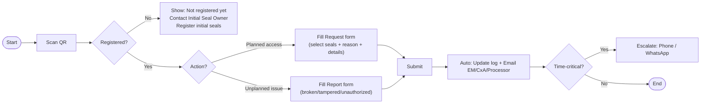

```mermaid
flowchart LR
A([Start]) --> B[Scan QR]
B --> C{Registered?}
C -- No --> D["Show: Not registered yet<br/>Contact Initial Seal Owner<br/>Register initial seals"]
C -- Yes --> E{Action?}
E -- Planned access --> F["Fill Request form<br/>(select seals + reason + details)"]
E -- Unplanned issue --> G["Fill Report form<br/>(broken/tampered/unauthorized)"]
F --> H[Submit]
G --> H[Submit]
H --> I["Auto: Update log + Email EM/CxA/Processor"]
I --> J{Time-critical?}
J -- Yes --> K["Escalate: Phone / WhatsApp"]
J -- No --> L([End])
```
